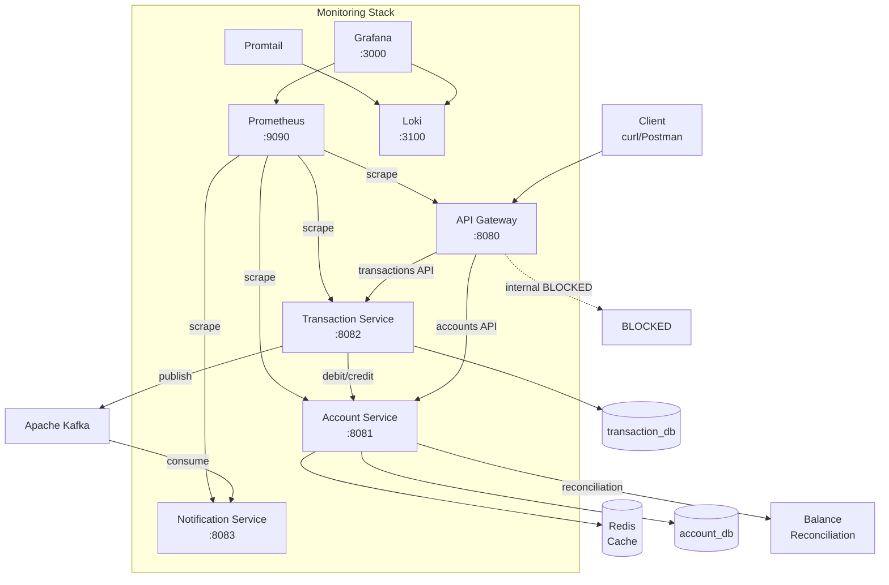

# Mock Banking Backend - Architecture

## System Overview

## Service Communication

| From | To | Protocol | Path | Purpose |
|------|-----|----------|------|---------|
| Client | API Gateway | HTTP | `/api/accounts/**` | Public account operations |
| Client | API Gateway | HTTP | `/api/transactions/**` | Public transaction operations |
| API Gateway | Account Service | HTTP | Proxied `/api/accounts/**` | Route to backend |
| API Gateway | Transaction Service | HTTP | Proxied `/api/transactions/**` | Route to backend |
| Transaction Service | Account Service | REST | `/internal/accounts/{id}/debit` | Debit account (internal) |
| Transaction Service | Account Service | REST | `/internal/accounts/{id}/credit` | Credit account (internal) |
| Transaction Service | Kafka | Event | `transaction-events` topic | Publish transaction completed |
| Kafka | Notification Service | Event | `transaction-events` topic | Consume and notify |

## Key Patterns

- **API Gateway**: Single entry point, auth filter (X-API-Key), rate limiting (Redis-backed), blocks `/internal/**`
- **Internal API**: Service-to-service only, not exposed through gateway
- **Event-Driven**: Kafka for async notification after transfer
- **Caching**: Redis `@Cacheable` on balance queries, `@CacheEvict` on mutations
- **Scheduled Jobs**: Balance reconciliation every 60s
- **Database-per-Service**: `account_db`, `transaction_db` (separate schemas)
- **Observability**: Prometheus metrics, Grafana dashboards, Loki log aggregation
